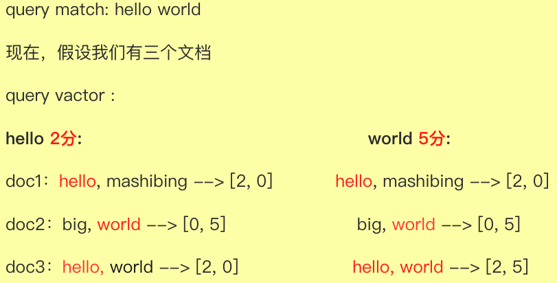
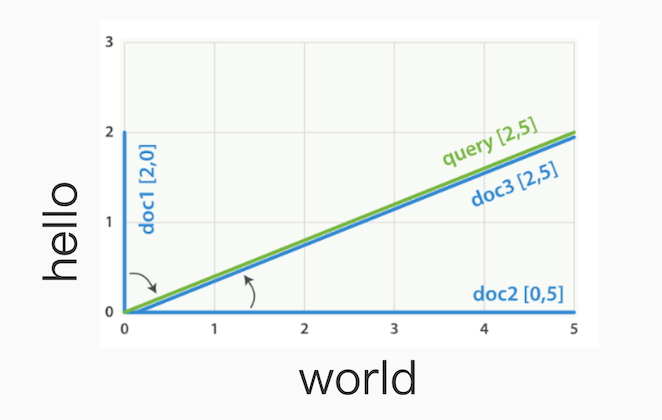

$$h_w(x)=\frac{1}{1+e^{-w^Tx}}$$

$ {4ac \over b} $
$ {4ac \over b} $


\frac {3} {4}

```
$$\frac{3}{4}$$
$\frac{3}{4}$
```

$\frac{n(q)}{N}$

$\frac{3}{4}$

$$\frac{3}{4}$$ 


# 1、相关度评分：_score

## 1.1 相关度

### 1.1.1 相关性概念

相关性指的是召回结果和用户搜索关键词的匹配程度，也就是和用户搜索的预期值的匹配程度，

### 1.1.2 搜索和检索

搜索和检索的区别在于查询条件边界的界定上面。

**搜索**：有明确的搜索边界条件，结果数量是确定的。如 eq、lte、gte 均属于搜索行为

**检索**：讲究相关度、没有明确的查询条件边界。比如搜索召回的结果有可能是因为拼音、谐音、热梗、别名、同义词等等而被匹配，但不同原因匹配到的结果权重不同。

## 1.2 相关度评分

相关度评分用于对搜索结果排序，评分越高则认为其结果和搜索的预期值相关度越高，即越符合搜索预期值。在7.x之前相关度评分默认使用**TF/IDF**算法计算而来，7.x之后默认为**BM25**。

默认情况下，Elasticsearch 按相关性分数对匹配的搜索结果进行排序，**相关性分数**衡量每个文档与查询的匹配程度。

相关性分数是一个正浮点数， 在响应上下文对象中`_score`元数据字段中返回。分数越高 ，文档越相关。虽然每种查询类型可以不同地计算相关性分数，但分数计算还取决于查询子句是在**查询**还是**过滤**上下文中运行。

在 TF-IDF 评分算法中，计算相关度评分主要依赖三个指标：**词频、反词频（或文档频率）以及文档长度规约**。

## 1.3 基本排序规则

如果没有指定排序字段，则默认按照评分高低排序，相关度评分为搜索结果的排序依据，默认情况下评分越高，则结果越靠前。

## 1.4 基本评分规则

以下是 Lucene 中定义的`TermFreq`（词频）和`Inverse Doc Frequency`（文档频率）的源代码

```
package org.apache.lucene.codecs;


import org.apache.lucene.index.TermsEnum; // javadocs

/**
 * Holder for per-term statistics.
 * 
 * @see TermsEnum#docFreq
 * @see TermsEnum#totalTermFreq
 */
public class TermStats {
  /** How many documents have at least one occurrence of
   *  this term. */
  // 包含当前Term的doc的数量
  public final int docFreq;
  
  /** Total number of times this term occurs across all
   *  documents in the field. */
  // 当前term在所有文档中的当前字段中出现的总次数
  public final long totalTermFreq;

  /** Sole constructor. */
  public TermStats(int docFreq, long totalTermFreq) {
    this.docFreq = docFreq;
    this.totalTermFreq = totalTermFreq;
  }
}
```

### 1.4.1 词频（TF term frequency ）

也叫**检索词频率**，关键词在每个doc中出现的次数，词频越高，评分越高。比如字段中出现过 5 次要比只出现过 1 次的相关性高。

**计算公式：**

```
tf(t in d) = √frequency 		// 词 t 在文档 d 的词频（ tf ）是该词在文档中出现次数的平方根
```

**示例：**

```
GET _cat/nodes
PUT /product_tf/_doc/1
{
   //“小米”：词频 1
  "name": "小米 大米 紫米 青米 红米 黑米 豌豆 大米"
}
PUT /product_tf/_doc/2
{
  //“小米”：词频 2
  "name": "小米 大米 紫米 青米 红米 黑米  豌豆 小米"
}
GET product_tf/_search
{
  "query": {
    "match": {
      "name": "大米"
    }
  }
}
```

### 1.4.2 反词频或文档频率（ IDF inverse doc frequency）：

关键词在整个索引中出现的次数，反词频越高，权重越低，评分越低

**计算公式：**

```
idf(t) = 1 + log ( numDocs / (docFreq + 1)) 	// 词 t 的逆向文档频率（ idf ）是：索引中文档数量除以所有包含该词的文档数，然后求其对数。
```

**示例：**

```
PUT /product_idf/_doc/1
{
  //“豌豆”：反词频 1
  "name": "小米 大米 紫米 青米 红米 黑米 豌豆"
}
PUT /product_idf/_doc/2
{
  //“小米”：反词频 2
  "name": "小米 大米 紫米 青米 红米 黑米 花生"
}
GET product_idf/_search
{
  "query": {
    "match": {
      "name": "小米 豌豆"
    }
  }
}
```

### 1.4.3 文档长度规约

字段长度越短，字段搜索权重越高，相关度评分越高。比如：检索词出现在一个短的 title 要比同样的词出现在一个长的 content 字段权重更大。

字段长度的归一值对全文搜索非常重要，许多其他字段不需要有归一值。无论文档是否包括这个字段，索引中每个文档的每个 `string` 字段都大约占用 1 个 byte 的空间。对于 `not_analyzed` 字符串字段的归一值默认是禁用的，而对于 `analyzed` 字段也可以通过修改字段映射禁用归一值：

**计算公式：**

```
norm(d) = 1 / √numTerms		// 字段长度归一值（ norm ）是字段中词数平方根的倒数。
```

**示例：**

```
PUT /product_doc/_doc/1
{
  //“小米”：词频1 反词频 2
  "name": "小米 大米 紫米 青米 红米 黑米 msb"
}
PUT /product_doc/_doc/2
{
  //“小米”：词频1 反词频 2
  "name": "小米 大米 紫米 青米 红米 黑米"
}
GET product_doc/_search

GET product_doc/_search
{
  "query": {
    "match": {
      "name": "小米"
    }
  }
}
```

# 2、TF-IDF算法

**词频（term frequency）、逆向文档频率（inverse document frequency）和字段长度归一值（field-length norm**） 是在索引时计算并存储的。最后将它们结合在一起计算单个词在特定文档中的 权重 。

当匹配到一组文档后，需要根据相关度排序这些文档，不是所有的文档都包含所有词，有些词比其他的词更重要。一个文档的相关度评分部分取决于每个查询词在文档中的 权重 。

## 2.1 Similarity

Elasticsearch 允许为每个字段配置评分算法或相似度算法。该`similarity`设置提供了一种简单的方法来选择除默认值之外的相似性算法`BM25`，例如`TF/IDF`。

相似性对[`text`](https://www.elastic.co/guide/en/elasticsearch/reference/7.13/text.html)字段最有用，但也适用于其他字段类型。可以通过调整内置相似度的参数来配置自定义相似度

- **classic**  ~~[ 7.0.0 ]~~ 

  也就是 TF/IDF，在2.x版本中为默认评分算法，在 7.x 中已弃用。[TF/IDF 算法](https://en.wikipedia.org/wiki/Tf–idf)，在 7.x 之前是 Elasticsearch 和 Lucene 中的默认 算法。

- **BM25**

  Okapi [BM25 算法](https://en.wikipedia.org/wiki/Okapi_BM25) 。在 5.x 之后为 Elasticsearch 和 Lucene 中默认使用的算法。

- **boolean**

  一个简单的布尔相似度，当不需要全文排序并且分数应该只基于查询词是否匹配时使用。布尔相似性给术语的分数等于它们的查询提升。

```
PUT my-index-000001
{
  "mappings": {
    "properties": {
      "default_field": { 
        "type": "text"  // 默认：BM25
      },
      "boolean_sim_field": {
        "type": "text",
        "similarity": "boolean"  // 使用: boolean
      }
    }
  }
}
```

## 2.2 空间向量模型（vector space model）

向量空间模型（vector space model）提供一种比较多词查询的方式，单个评分代表文档与查询的匹配程度，为了做到这点，这个模型将文档和查询都以 *向量（vectors）* 的形式表示：

向量实际上就是包含多个数的一维数组，例如：[1,2,5,22,3,8]

向量空间模型里的每个数字都代表一个词的权重






## 2.3 评分计算函数

```
score(q,d)  =  
            queryNorm(q)  
          · coord(q,d)    
          · ∑ (           
                tf(t in d)   
              · idf(t)²      
              · t.getBoost() 
              · norm(t,d)    
            ) (t in q)
```

- score(q,d)：query对一个doc最终的评分结果。

- queryNorm(q)：想想normalization，在不影响相互关系的前提下，把看似离散的数据，转换到一个相近的区间=>人性化

  - queryNorm = 1 /√sumOfSquaredWeights 
  - sumOfSquaredWeights 是通过将查询中每个term的 IDF 平方相加来计算的。

-  coord(q,d)：可以为那些查询词包含度高的文档提供奖励加成，文档里出现的查询词越多，它越有机会成为好的匹配结果。

  加入用搜索词词为 `hello word elastic` ，每个词的权重都是 1.5 。如果没有协调因子，最终评分会是文档里所有词权重的总和。例如：

  - 文档里包含 `hello` → 评分： 1.5
  - 文档里包含 `hello word` → 评分： 3.0
  - 文档里包含 `hello word elastic` → 评分： 4.5

  协调因子将评分与文档里匹配词的数量相乘，然后除以查询里所有词的数量，如果使用协调因子，评分会变成

  - 文档里包含：hello → score: 1.5 * 1 / 3 = 0.5
  - 文档里包含：hello word → score: 3.0 * 2 / 3 = 2.0
  - 文档里包含：hello word elastic → score: 4.5 * 3 / 3 = 4.5

  将评分与文档里匹配词的数量相乘，然后除以查询里所有词的数量

  **实际分数 = 总分数 * 匹配的term数 / 总term数**

-  ∑：doc 对 query 中每个trem的权重的总和

-  tf(t in d)： 
  - tf(t in d) = √frequency
  - 该trem在doc中出现的次数的平方根

- idf(t)：词项 `t` 的逆向文档频率（ `idf` ）是：索引中文档数量除以所有包含该词的文档数，然后求其对数
  - idf(t) = 1+ log ( numDocs / (docFreq + 1))
  - idf(t) = 1+ log((docCount+1)/(docFreq+1)) 
  
- t.getBoost()：设置的权重值.

- norm(t,d)：字段长度越长，结果越小
  - norm(d) = 1 / √numTerms
  - 字段长度范数(范数)是字段中词项数的平方根的倒数

## 2.4 Explain API

作用：返回当前召回文档为什么会被匹配，或者为什么没有被匹配。

语法：

```
GET /<index>/_search
{
  "explain": true,
  "query": {
    ...
  }
}

GET <index>/_doc/1/_explain
{
  "query":{
    .
  }
}
# 或者 注意：下面方法不适用于 ES 7.x 之前版本
GET product/_explain/1
{
  "query":{
    ...
  }
}
```


# 3、BM25算法

## 3.1 引言

`BM25`（全称：Okapi BM25） 其中 BM 指的 Best Matching 的缩写，是搜索引擎常用的一种相关度评分函数。和`TF/IDF`一样，BM25 也是基于词频和文档频率和文档长度相关性来计算相关度，但是规则有所不同，文章中将会给出详细讲解。

`BM25` 也被认为是 目前最先进的 评分算法。

## 3.2 相关度概率模型

BM25 是一个 bag-of-words 检索功能，它根据每个文档中出现的查询词对一组文档进行排名，而不管它们在文档中的接近程度如何。它是一系列评分函数，其组件和参数略有不同。


## 3.3 Okapi BM25 函数


给定一个查询，包含关键词  ，对于文档  的 BM25 分数为计算公式：


%3D%5Csum_%7Bi%3D1%7D%5EnIDF(q_i)%20%5Cbull%20S(q_i%2CD)%20%0A)


- )：表示查询对文档的最终评分
- )：表示查询词的  权重，其计算公式为
- )：表示
- ：表示查询Q中第 i 个 term
- ：表示当前计算评分的文档


### 3.3.1 逆文档频率：)


#### 函数公式及参数


%3Dln(%7BN-n(q_i)%2B0.5%20%5Cover%20n(q_i)%2B0.5%7D%2B1)%0A)


- ：指的是索引中的文档总数
- )：表示包含的文档的  的文档个数。


#### 函数曲线

以下是 ) 随着文档频率 )（反词频）的变化曲线：

BM25 的 IDF 看起来与经典的 Lucene IDF 差别不大。这里存在差异的原因是它采用了`概率相关模型`，而 TF-IDF 所使用的的是`向量空间模型` 。


#### 总结

原本 ) 对文档频率（反词频）非常高的词项是有可能计算出负值得出负分的，所以 Lucene 对 BM25 的常规 IDF 进行了一项优化：通过在获取对数之前将值加 1，让结果无法得出负值。最终结果是一个看起来和 Lucene 当前的 IDF 曲线极为相似的 IDF曲线。


BM25 相对于 TF-IDF 在 IDF 计算分数的层面上增益并不明显。


### 3.3.2 词频相关性函数：)


#### 函数及参数


%3D%7Bf(q_i%2CD)%20%5Cbull%20(k_1%2B1)%5Cover%20f(q_i%2CD)%2B%20K%7D%0A)


- )：表示词项  在文档  中的词频。
- ：表示文档长度相关性（这里的文档长度指的是词项个数）。
- ：控制非线性项频率归一化（饱和度），默认值为1.2。


#### 相关性曲线


在 `TF-IDF` 算法中，)可以对匹配到的词项提供加成，文档中出现的次数越多，加成越多，这个关系是一个线性函数。


但是，如果同一个 doc 中，出现了 1000 次某个相同的词项，比如 *id = 1 的文档的 title 字段为：“****苹果-苹果- ··· -苹果\****”（共 1000 次苹果），而* id = 2 的文档的 title 字段为：“**苹果-苹果-···-苹果**”（共 100 次苹果）。那么对于词项“苹果”，**文档1**的相关性应该是**文档2**的十倍吗？


显然不是，对于文档一和文档二，这两个文档对苹果这个词项的相关性应该是非常接近的，换句话说，当文档中出现了一个词项的时候，后面再次出现相同词项，对当前文档的相关性虽然应该有提升，但是提升幅度应该逐渐下降。当词频足够多或者说达到某个阈值的时候，再增加词频对于相关度的提升应该无限趋近于0。


降低 TF 的增益权重的常用手段是对其取平方根，但是这仍然是一个无穷大函数，所以就需要设置一个阈值来限制 TF 的最大值。而  就是控制因子。


对于 %20%5Cbull%20(k_1%2B1)%5Cover%20f(q_i%2CD)%2B%20K%7D)，将分子分母同时➗ )：


%20%5Cbull%20(k_1%2B1)%5Cover%20f(q_i%2CD)%2B%20K%7D%3D%7B%20k_1%2B1%5Cover%20%7BK%5Cover%20f(q_i%2CD)%7D%2B1%7D%0A)


其中， 此时为常量，也为常量，默认为 1.2，随着)的不断增大，) 无限趋近于 0，因此%7D%2B1)无限趋近于1，所以此时 )的值为最大值，也就是 。


也就是说，当文档频率不断增大，TF 得分最大值也就是 ，而不会继续增大下去。


[BM25降低了TF的对评分增益率](https://img-blog.csdnimg.cn/3f7e133cfea24ca491be38c1a6d0b0c1.png)


非常直观的可以看到，这条曲线随着词频的不断增大，无限地趋近于 (k + 1)（默认 k = 1.2）

#### 值的作用：

我们可以人为的通过设置 k 的值来控制最大 TF 得分。更重要的一点是增加 k 的值可以延迟 TF 达到最大值的速度，通过拉伸这个临界值，可以来调节较高和较低词频之间的差异相关性。

### 3.3.3 文档长度相关性：


%0A)


- ：控制非线性项频率归一化（饱和度），默认值为1.2。
- ：控制文档长度标准化值的程度，默认值为0.75。
- ：表示文档D的词项长度，即 term 数量
- ：表示所有文档的平均长度，这里的长度指的是词项的数量。


假设 ，即 


下图是不同  下，) 随着词频的变化曲线：

- 紫色曲线为： = ，即`当前文档长度:平均文档长度 = 1:5`
- 红色曲线为： = 1，即`当前文档长度:平均文档长度 = 1:1`
- 橙色曲线为： = 5，即`当前文档长度:平均文档长度 = 5:1`
  
  从图中可以看出，越小，越快的随着词频的增加而达到 ) 即`TF`评分阈值，也就是最佳分数。


总的来说：当词频越小的时候，提升词频对评分的帮助是越大的。反之，当词频足够的时候，再提升词频对)的提升几乎无帮助。


## 3.4 最终函数公式


%3D%5Csum_%7Bi%3D1%7D%5Enln(%7BN-n(q_i)%2B0.5%20%5Cover%20n(q_i)%2B0.5%7D%2B1)%5Cbull%20%7Bf(q_i%2CD)%20%5Cbull%20(k_1%2B1)%5Cover%20f(q_i%2CD)%2B%20K%7D%20%0A)


# 4、Shard Local IDF

# 5、Relevance Score

# 6、精准控制评分干预排序

